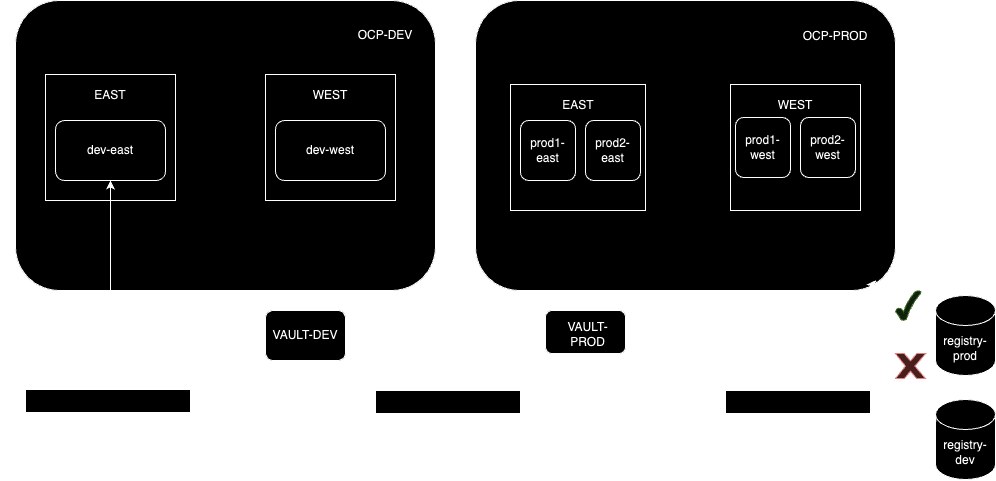

## Cluster configs using gitops
- Helm chart
  `helm dependency build`
- `oc label managedclusters local-cluster env=dev`
- `oc label managedclusters dev-east2 env=dev`
- `oc label managedclusters prod-west env=prod`
oc apply -f acm-gitops-integration
oc label managedcluster local-cluster cluster.open-cluster-management.io/clusterset=west
oc label managedcluster prod-west cluster.open-cluster-management.io/clusterset=west
oc label managedclusters dev-east2 cluster.open-cluster-management.io/clusterset=east
oc apply -f acm-gitops-integration

## Links
https://piotrminkowski.com/2022/10/24/gitops-with-advanced-cluster-management-for-kubernetes/
https://medium.com/@mprzygrodzki/argocd-applicationsset-with-helm-72bb6362d494