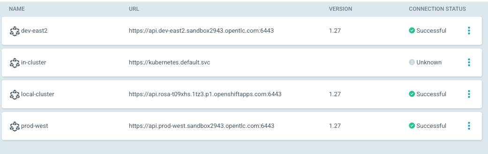
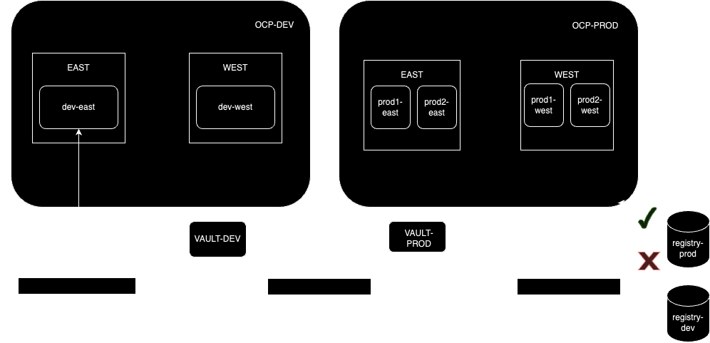

## Cluster configs using Gitops
### ACM-Openshift GitOps itegration
To enable ArgoCD integration with OpenShift Container Platform (OCP) clusters managed by Advanced Cluster Management (ACM), a binding resource between them is essential. 

Provide ArgoCD cluster is installed on `openshift-gitops` namespace, first create `clustersets` and bind them to the `openshift-gitops` namespace. A clusterset logically groups multiple OCP clusters, enabling administrators to manage and deploy applications across them seamlessly. Only clustersets bound to a namespace can be accessed by the `Placement` resource.

**cluster-set.yaml**
```yaml
apiVersion: cluster.open-cluster-management.io/v1beta2
kind: ManagedClusterSet
metadata:
  name: east
spec: {}
```
**cluster-set-binding.yaml**
```yaml
apiVersion: cluster.open-cluster-management.io/v1beta2
kind: ManagedClusterSetBinding
metadata:
  name: east
  namespace: openshift-gitops
spec:
  clusterSet: east
```
To add a managed cluster to clusterset, adding a label `cluster.open-cluster-management.io/clusterset=<CLUSTER_SET>` to the managed cluster
```sh
oc label managedcluster local-cluster cluster.open-cluster-management.io/clusterset=west
oc label managedcluster prod-west cluster.open-cluster-management.io/clusterset=west
oc label managedclusters dev-east2 cluster.open-cluster-management.io/clusterset=east
```
The next step involves creating `Placement` and `GitOpsCluster` resources. `Placement` specifies which managed clusters each subscription, policy, or other definitions, including `GitOpsCluster`, affect. `GitOpsCluster` assigns managed clusters to the target instance of ArgoCD.


Adding this resource also creates OCP secrets with the label `argocd.argoproj.io/secret-type=cluster`
**placement.yaml**
```yaml
apiVersion: cluster.open-cluster-management.io/v1beta1
kind: Placement
metadata:
  name: all-gitops-placement
  namespace: openshift-gitops
spec:
  clusterSets:
    - east
    - west
```
**gitops-cluster.yaml**
```yaml
apiVersion: apps.open-cluster-management.io/v1beta1
kind: GitOpsCluster
metadata:
  name: gitops-clusters
  namespace: openshift-gitops
spec:
  argoServer:
    cluster: local-cluster
    argoNamespace: openshift-gitops
  placementRef:
    kind: Placement
    apiVersion: cluster.open-cluster-management.io/v1beta1
    name: all-gitops-placement
```

oc apply -f acm-gitops-integration

- Helm chart
  `helm dependency build`
- `oc label managedclusters local-cluster env=dev`
- `oc label managedclusters dev-east2 env=dev`
- `oc label managedclusters prod-west env=prod`
oc apply -f acm-gitops-integration
## Links
https://piotrminkowski.com/2022/10/24/gitops-with-advanced-cluster-management-for-kubernetes/
https://medium.com/@mprzygrodzki/argocd-applicationsset-with-helm-72bb6362d494