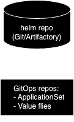
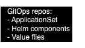

## Cluster configs using Gitops
### ArgoCD installation
- Using [helm chart](https://github.com/argoproj/argo-helm/tree/main)
#### Argo Rollouts
- Install [plugin](https://argo-rollouts.readthedocs.io/en/stable/installation/#kubectl-plugin-installation)
Test: `oc argo rollouts version`
### ACM-Openshift GitOps itegration
To enable ArgoCD integration with OpenShift Container Platform (OCP) clusters managed by Advanced Cluster Management (ACM), a binding resource between them is essential. 

Provide ArgoCD cluster is installed on `openshift-gitops` namespace, first create `clustersets` and bind them to the `openshift-gitops` namespace. A clusterset logically groups multiple OCP clusters, enabling administrators to manage and deploy applications across them seamlessly. Only clustersets bound to a namespace can be accessed by the `Placement` resource.

**cluster-set.yaml**
```yaml
apiVersion: cluster.open-cluster-management.io/v1beta2
kind: ManagedClusterSet
metadata:
  name: east
spec: {}
```
**cluster-set-binding.yaml**
```yaml
apiVersion: cluster.open-cluster-management.io/v1beta2
kind: ManagedClusterSetBinding
metadata:
  name: east
  namespace: openshift-gitops
spec:
  clusterSet: east
```
To add a managed cluster to clusterset, adding a label `cluster.open-cluster-management.io/clusterset=<CLUSTER_SET>` to the managed cluster
```sh
oc label managedcluster local-cluster cluster.open-cluster-management.io/clusterset=west
oc label managedcluster prod-west cluster.open-cluster-management.io/clusterset=west
oc label managedclusters dev-east2 cluster.open-cluster-management.io/clusterset=east
```
The next step involves creating `Placement` and `GitOpsCluster` resources. `Placement` specifies which managed clusters each subscription, policy, or other definitions, including `GitOpsCluster`, affect. `GitOpsCluster` assigns managed clusters to the target instance of ArgoCD.


Adding this resource also creates OCP secrets with the label `argocd.argoproj.io/secret-type=cluster`
**placement.yaml**
```yaml
apiVersion: cluster.open-cluster-management.io/v1beta1
kind: Placement
metadata:
  name: all-gitops-placement
  namespace: openshift-gitops
spec:
  clusterSets:
    - east
    - west
```
**gitops-cluster.yaml**
```yaml
apiVersion: apps.open-cluster-management.io/v1beta1
kind: GitOpsCluster
metadata:
  name: gitops-clusters
  namespace: openshift-gitops
spec:
  argoServer:
    cluster: local-cluster
    argoNamespace: openshift-gitops
  placementRef:
    kind: Placement
    apiVersion: cluster.open-cluster-management.io/v1beta1
    name: all-gitops-placement
```
### Openshift GitOps demo
#### GitOps repository structure
Rather than using separate branches for each environment or cluster, which is considered [an anti pattern](https://codefresh.io/blog/stop-using-branches-deploying-different-gitops-environments/), our demo employs a streamlined structure utilizing a single Git branch to orchestrate all GitOps activities for day 2 configs.

Here's an overview of the repository structure:
- `Monorepo`: We house all components and their GitOps operations here for streamlined CI/CD. This consolidation is particularly beneficial for managing Day 2 configurations, as they are often interrelated. However, we recognize the flexibility of separate repositories for components and GitOps tasks if they are distinct.
- `components` directory: Contains applications treated as ArgoCD applications. These can be Helm charts, Kustomize configurations, or any other ArgoCD-supported application types.
- `targets` directory: Houses targeted clusters, categorized into environments (dev/stage/prod) or stacks (east/west), along with specific clusters. Within these directories, the customized values for components are listed, facilitating their application using ApplicationSet. An alternative structure could involve separate targets directories for each component.
- `application-set` directory: 1 set per component or other combinations like stacks or environments.


### ApplicationSet configs
#### Enable webhook
- Create route for application set controller(edge termination to 7000)
- On Git, add $APPSET_ROUTE/api/webhook as URL
### Helm chart structures
- Reusable helm charts: suitable for apps/components with same structure, e.g. spring-boot/nodejs apps.  



- One-off helm components: can be hosted within GitOps repo(monorepo) on on its own repo. The custom values files should be part of GitOps repo.



## References
- https://piotrminkowski.com/2022/10/24/gitops-with-advanced-cluster-management-for-kubernetes/
- https://medium.com/@mprzygrodzki/argocd-applicationsset-with-helm-72bb6362d494
- https://codefresh.io/blog/how-to-structure-your-argo-cd-repositories-using-application-sets/?_gl=1*tbotel*_up*MQ..*_ga*ODU5NjA5NzA1LjE3MTY5OTIwMzI.*_ga_TM00L7W132*MTcxNjk5MjAzMS4xLjAuMTcxNjk5MjAzMS4wLjAuMA..